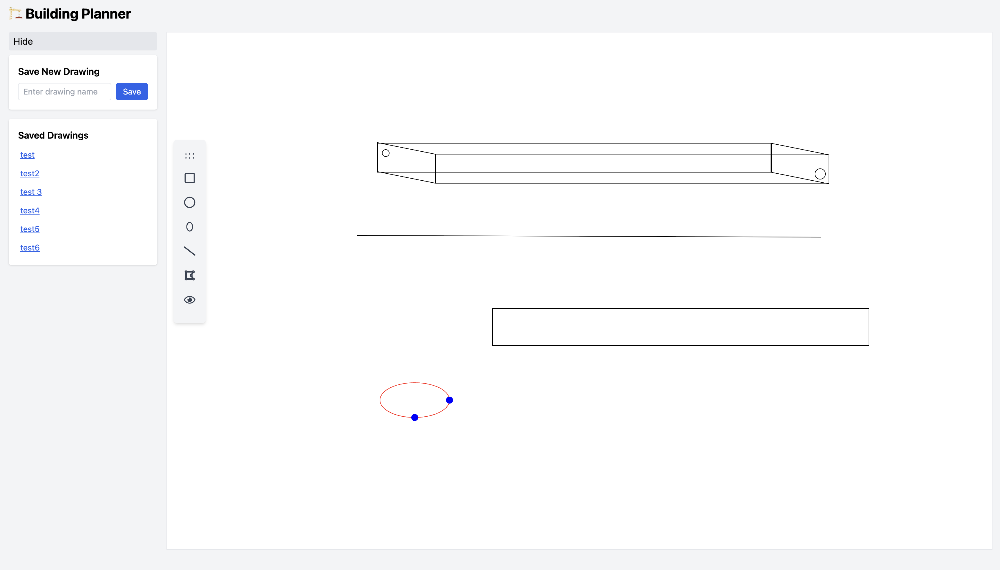
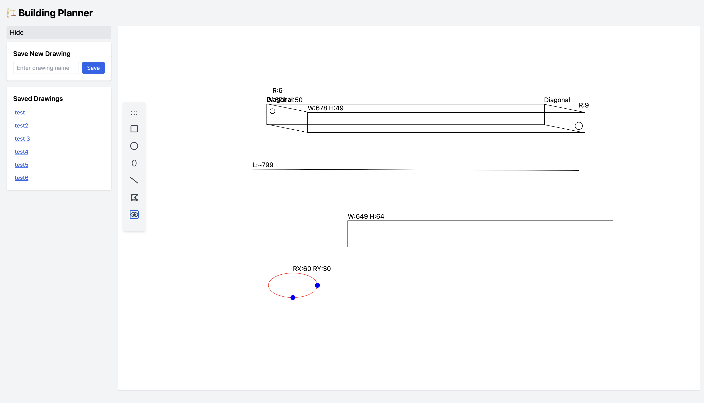

# 🏗️ Building Planner (L2 Assignment)

A web application that allows users to create, annotate, and view building plans using various drawing tools. Built with React, SVG, Redux, and Tailwind CSS for a smooth, interactive UI experience.

---

## ✨ Features

- **Drawing Tools**: Create rectangles, circles, ellipses, lines, and diagonals.
- **Draggable Toolbar**: Reposition the tool menu freely on the canvas.
- **Shape Annotations**: Automatically label shapes with dimensions.
- **Selectable Shapes**: Click to select, move, or edit shapes.
- **Toggle Annotations**: Easily show/hide annotations with a single click.
- **Hidden Line Logic**: When drawing 3D-like shapes (e.g. cubes), lines meant to be "behind" are hidden automatically.
- **Minimal UI**: Clean interface for enhanced user focus and usability.

---

## 🖼️ Screenshots
 Main Interface

 
  

---

## 🧱 Tech Stack

- **Frontend**: React.js
- **State Management**: Redux Toolkit
- **Styling**: Tailwind CSS
- **Canvas**: SVG

---


## 🧠 Data Model

Each shape stored in Redux has the following structure:

```js
{
  type: "rectangle" | "circle" | "ellipse" | "line" | "diagonal",
  coords: { ... }, // varies by shape
  annotation: { label: "W:100 H:60" }
}
```

---

## Setup Instructions
📦 Prerequisites
Node.js ≥ 14.x

npm or yarn

```js
git clone https://github.com/neeru0713/vcriateassignment
cd building-planner
npm install
npm run dev
```


## 🗂️ Backend APIs
A simple Express.js server handles persistence of drawings using MongoDB.

## 📤 Save Drawing
POST /api/drawings

Saves the current shapes with a custom name.

Request Body:

```json
{
  "name": "Living Room Plan",
  "shapes": [ ... ]
}
```

## 📥 List All Drawings
GET /api/drawings

Fetches all saved drawings with their names and IDs.

## 📄 Get Single Drawing
GET /api/drawings/:id

Loads a specific saved drawing by ID and restores the shapes into the canvas.

## 💾 Save & Load Features
Drawings can be saved with custom names.

A collapsible sidebar menu lists all saved drawings.

Click any saved drawing to load it back into the canvas instantly.


## Submission Notes
✅ All required tools implemented

✅ Clean, minimal interface with Tailwind

✅ Annotation toggle and shape manipulation

✅ Hidden line detection logic included

✅ Extra: Draggable toolbar and ellipse support


